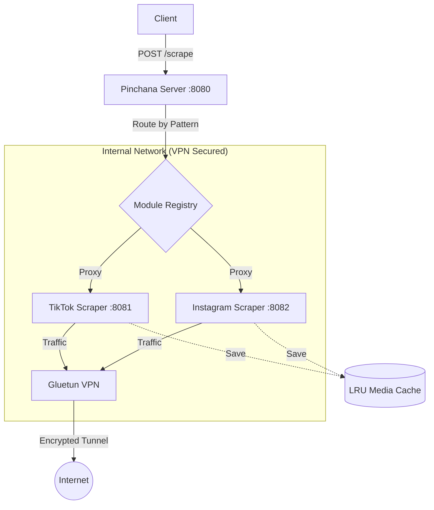

# 🐘 Pinchana API

[](https://opensource.org/licenses/MIT)
[](https://www.python.org/downloads/release/python-3130/)
[](https://www.docker.com/)
[](https://github.com/Pinchana/pinchana-api/actions/workflows/docker-publish.yml)

**Pinchana** is a unified, high-performance scraping gateway designed to extract media from TikTok and Instagram reliably. It solves common scraping challenges by routing all traffic through a rotating VPN (via [Gluetun](https://github.com/qdm12/gluetun)) and employing advanced bypass techniques.

---

## 📖 Table of Contents

- [✨ Key Features](#-key-features)
- [🏗 Architecture](#-architecture)
- [📂 Repository Structure](#-repository-structure)
- [🚀 Quick Start](#-quick-start)
- [⚙️ Configuration](#-configuration)
- [📡 API Usage](#-api-usage)
- [🛠 Development](#-development)
- [📜 License](#-license)

---

## ✨ Key Features

- **🎯 Unified API:** A single gateway (`/scrape`) to handle different social media platforms.
- **🛡 VPN-First Design:** Zero-trust networking. Scrapers have no direct internet access; all traffic *must* exit through the VPN.
- **🔄 Smart Rotation:** Automatic IP rotation when rate limits (403/429) are detected.
- **💾 Global Media Cache:** Persistent LRU (Least Recently Used) cache for images and videos to save bandwidth and avoid re-scraping.
- **🧩 Extensible Architecture:** Easily add new scraper modules by defining simple route patterns.
- **🐳 Container Managed:** Optional auto-lifecycle management for scraper containers via the gateway.

---

## 🏗 Architecture

Pinchana follows a modular architecture where a central gateway routes requests to specialized scraper modules.



- **Pinchana Server:** FastAPI gateway. Manages module discovery, request routing, and optional container lifecycle.
- **Scraper Modules:** Standalone services (TikTok, Instagram) that perform the actual extraction.
- **Gluetun:** VPN sidecar ensuring all outgoing traffic is protected and rotatable.
- **Pinchana Core:** Shared library providing models, storage logic, and VPN signaling.

---

## 📂 Repository Structure

The project is organized as a monorepo with submodules for each component:

| Directory | Component | Description |
|-----------|-----------|-------------|
| [`pinchana-server/`](./pinchana-server) | **Gateway** | Central FastAPI router and module manager. |
| [`pinchana-core/`](./pinchana-core) | **Core** | Shared logic: LRU Cache, VPN control, Docker orchestration. |
| [`pinchana-inst/`](./pinchana-inst) | **Instagram** | High-performance scraper (GraphQL + Playwright fallback). |
| [`pinchana-tiktok/`](./pinchana-tiktok) | **TikTok** | Custom yt-dlp based extractor for TikTok media. |
| `config/` | **Config** | Runtime configuration (e.g., `modules.yaml`). |

---

## 🚀 Quick Start

### 1. Clone the Repository
Ensure you clone with submodules to get all components:
```bash
git clone --recursive https://github.com/Pinchana/pinchana-api.git
cd pinchana-api
```

### 2. Configure Environment
Create a `.env` file from the example:
```bash
cp .env.example .env
```
Add your **NordVPN WireGuard Private Key** (NordLynx):
```env
WIREGUARD_PRIVATE_KEY=your_private_key_here
```
*(See [Configuration](#-extracting-your-nordvpn-wireguard-private-key) for instructions on how to get this key.)*

### 3. Run with Docker Compose
To run using pre-built images from GHCR (default):
```bash
docker compose up -d
```
To build and run locally from source:
```bash
docker compose -f docker-compose.dev.yml up -d --build
```
This will start the Gateway, Scrapers, and VPN.

### 4. Verify Installation
```bash
curl http://localhost:8080/health
```

---

## ⚙️ Configuration

### Environment Variables

| Variable | Required | Default | Description |
|----------|----------|---------|-------------|
| `WIREGUARD_PRIVATE_KEY` | **Yes** | — | Your VPN WireGuard private key. |
| `SERVER_COUNTRIES` | No | — | Comma-separated list of countries (e.g., `Netherlands,Germany`). |
| `CACHE_MAX_SIZE_GB` | No | `10.0` | Maximum size for the media cache. |
| `CONTAINER_MODE` | No | `true` | Enable container management features in the gateway. |

### 🔑 Extracting your NordVPN WireGuard Private Key
1. Connect to NordVPN using the CLI: `nordvpn connect`.
2. Run: `sudo wg show nordlynx private-key`.
3. Copy the output to your `.env` file.

---

## 📡 API Usage

### Scrape a URL
The gateway automatically detects the platform based on the URL.

```bash
curl -X POST http://localhost:8080/scrape \
  -H "Content-Type: application/json" \
  -d '{"url": "https://www.tiktok.com/@username/video/1234567890"}'
```

### Admin Endpoints
- `POST /admin/vpn/rotate`: Trigger an immediate IP change.
- `GET /admin/vpn/status`: Check current VPN health and IP.
- `GET /admin/modules`: List active scraper modules.

---

## 🛠 Development

### Using `uv` for Package Management
Each sub-project is a standalone Python package managed by [uv](https://github.com/astral-sh/uv).

```bash
cd pinchana-server
uv sync
uv run uvicorn src.pinchana_server.main:app --reload
```

### Adding a New Module
1. Create a new directory (e.g., `pinchana-youtube`).
2. Implement the `/scrape` endpoint returning the standard `ScrapeResponse` model.
3. Add the module configuration to `config/modules.yaml`.

---

## 📜 License

Distributed under the MIT License. See `LICENSE` for more information.
